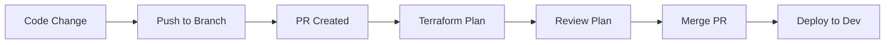
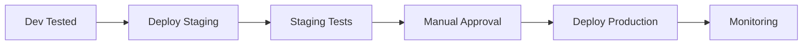

# 🚀 AKS Infrastructure Deployment Guide

Step-by-step guide for deploying AKS infrastructure using the GitHub Actions workflows in this repository.

## 📋 Prerequisites

- Azure subscription with Owner or Contributor permissions
- GitHub repository with admin access
- Azure CLI installed locally (for troubleshooting)

## 🔧 Initial Setup (One-time)

### 1. Authentication Setup (2 minutes)

Run the federated identity setup script:

```bash
# Clone repository (if not already done)
git clone https://github.com/YOUR_USERNAME/aks-private.git
cd aks-private

# Login to Azure
az login

# Run automated setup
./.github/setup-federated-identity.sh
```

**What this creates:**
- User-assigned managed identity in Azure
- Federated credentials for GitHub OIDC
- Required GitHub repository secrets (3 total)
- GitHub environments (dev, staging, prod)

### 2. Verify Setup

Check that secrets were created:
```bash
gh secret list
```

Should show:
- `AZURE_CLIENT_ID`
- `AZURE_SUBSCRIPTION_ID` 
- `AZURE_TENANT_ID`

## 🏗️ Infrastructure Deployment

### Step 1: Setup Terraform Backend

1. **Navigate to Actions**: Go to your GitHub repository → Actions tab
2. **Select Workflow**: Click "🔧 Setup Terraform Backend"
3. **Run Workflow**:
   - Click "Run workflow" dropdown
   - Select environment: `dev` (recommended for first deployment)
   - Click "Run workflow" button
4. **Monitor Progress**: Watch the workflow execution

**What this does:**
- Creates Azure Storage Account for Terraform state
- Sets up blob container with versioning
- Configures state locking
- Validates backend connectivity

### Step 2: Deploy AKS Infrastructure

1. **Navigate to Actions**: GitHub repository → Actions tab
2. **Select Workflow**: Click "🚀 Terraform Plan & Apply"
3. **Run Workflow**:
   - Click "Run workflow" dropdown
   - Environment: `dev`
   - Action: `plan` (to preview changes)
   - Auto approve: `false`
   - Click "Run workflow" button
4. **Review Plan**: Check workflow logs for planned changes
5. **Apply Changes**: 
   - Run workflow again with Action: `apply`
   - Set Auto approve: `true` (or `false` for manual approval)

## 📊 Deployment Environments

### Development Environment
- **Purpose**: Testing and development
- **Protection**: None (immediate deployment)
- **Resources**: Minimal SKUs for cost efficiency

### Staging Environment  
- **Purpose**: Pre-production testing
- **Protection**: Wait timer
- **Resources**: Production-like configuration

### Production Environment
- **Purpose**: Live workloads
- **Protection**: Manual approval required
- **Resources**: High availability configuration

## 🔄 Regular Operations

### Updating Infrastructure

1. **Make Changes**: Edit Terraform files in `infra/tf/`
2. **Create PR**: Push changes and create pull request
3. **Automatic Plan**: Workflow runs `terraform plan` on PR
4. **Review**: Check plan output in PR comments
5. **Merge**: Merge PR to trigger apply (if configured)

### Monitoring Deployments

**GitHub Actions:**
- Check workflow status in Actions tab
- Download artifacts for detailed logs
- Review PR comments for plan output

**Azure Portal:**
- Monitor resource group creation
- Check AKS cluster status
- Review cost management

## 🛠️ Customization

### Configuration Files

Edit `infra/tf/terraform.tfvars` for environment-specific settings:

```hcl
# Basic Configuration
environment = "dev"
location    = "Central US"

# Resource Naming
resource_group_name = "rg-aks-dev-cus-001"
cluster_name       = "aks-cluster-dev-cus-001"

# AKS Settings
kubernetes_version     = "1.29"
system_node_count     = 1
user_node_count       = 1
node_vm_size          = "Standard_D2s_v3"

# Security
private_cluster_enabled = true
enable_azure_policy     = true
enable_oms_agent       = true

# Networking
vnet_address_space = ["10.0.0.0/16"]
subnet_address_prefix = "10.0.1.0/24"
```

### Environment Variables

Set environment-specific variables in GitHub:

1. **Repository Settings** → **Environments**
2. **Select Environment** (dev/staging/prod)
3. **Add Variables**:
   - `TF_VAR_location`: Azure region
   - `TF_VAR_node_count`: Number of nodes
   - `TF_VAR_vm_size`: VM size

## 🔍 Troubleshooting

### Common Issues

**❌ Authentication Failed**
```bash
# Verify secrets
gh secret list

# Check managed identity
az identity show --name "github-actions-terraform-aks" \
  --resource-group "rg-github-actions-identity"
```

**❌ Backend Setup Failed**
- Check storage account name availability
- Verify subscription permissions
- Review Azure quota limits

**❌ Terraform Plan Failed**
- Validate terraform files: `terraform validate`
- Check variable values in `terraform.tfvars`
- Review Azure resource limits

**❌ Apply Failed**
- Check Azure quota limits
- Verify network configuration
- Review AKS version availability

### Debug Commands

```bash
# Test Azure authentication
az account show

# Validate Terraform configuration
cd infra/tf && terraform init && terraform validate

# Check AKS versions
az aks get-versions --location "Central US" --output table

# List available VM sizes
az vm list-sizes --location "Central US" --output table

# Check quota usage
az vm list-usage --location "Central US" --output table
```

### Workflow Artifacts

Download workflow artifacts for detailed troubleshooting:
1. **Actions** → **Select workflow run**
2. **Scroll to Artifacts** section
3. **Download**:
   - `terraform-plan` (plan output)
   - `terraform-state` (state file backup)
   - `workflow-logs` (detailed execution logs)

## 🎯 Best Practices

### Development Workflow
1. **Test locally** before committing
2. **Use small commits** with clear messages
3. **Always review plans** before applying
4. **Use PR workflow** for all changes

### Resource Management
- **Tag resources** consistently
- **Monitor costs** regularly
- **Right-size resources** for environment
- **Clean up unused resources**

### Security
- **Regular access reviews** of managed identity
- **Monitor Azure AD sign-ins**
- **Enable Azure Security Center**
- **Use private endpoints** where possible

## 📈 Scaling Up

### Moving to Production

1. **Test thoroughly** in dev/staging
2. **Configure production environment**:
   - Enable environment protection rules
   - Set up manual approval requirements
   - Configure appropriate VM sizes
3. **Update DNS and networking**
4. **Set up monitoring and alerting**
5. **Configure backup strategies**

### Multi-Region Deployment

For multi-region deployments:
1. **Create region-specific environments**
2. **Update terraform.tfvars** for each region
3. **Configure cross-region networking**
4. **Set up traffic management**

---

> **💡 Tip**: Start with the dev environment to test your configuration, then promote successful changes through staging to production.

# Run the service principal setup
.github/setup-service-principal.sh
```

### 2. Configure GitHub Secrets (2 minutes)

1. Go to your repository: `https://github.com/YOUR_USERNAME/YOUR_REPO`
2. Navigate to: **Settings** → **Secrets and variables** → **Actions**
3. Add the secrets provided by the setup script:
   - `AZURE_CREDENTIALS`
   - `AZURE_CLIENT_ID`
   - `AZURE_CLIENT_SECRET`
   - `AZURE_SUBSCRIPTION_ID`
   - `AZURE_TENANT_ID`

### 3. Setup GitHub Environments (1 minute)

1. Go to **Actions** tab in your repository
2. Select **"🌍 Setup GitHub Environments"** workflow
3. Click **"Run workflow"** → **"Run workflow"**
4. Wait for completion (creates dev, staging, prod environments)

### 4. Setup Terraform Backend (3 minutes)

1. Go to **Actions** tab
2. Select **"🔧 Setup Terraform Backend"** workflow
3. Click **"Run workflow"**
4. Select environment: **dev**
5. Click **"Run workflow"**
6. Wait for completion

### 5. Deploy Infrastructure (5-15 minutes)

1. Go to **Actions** tab
2. Select **"🚀 Terraform Plan & Apply"** workflow
3. Click **"Run workflow"**
4. Configure:
   - Environment: **dev**
   - Action: **plan**
   - Auto approve: **false**
5. Click **"Run workflow"**
6. Review the plan output
7. If satisfied, run again with Action: **apply**

## 📋 Detailed Setup Instructions

### Step 1: Azure Service Principal Setup

The service principal provides GitHub Actions with permissions to manage Azure resources.

```bash
# Option 1: Use the provided script
.github/setup-service-principal.sh

# Option 2: Manual setup
az ad sp create-for-rbac \
  --name "github-actions-terraform" \
  --role="Contributor" \
  --scopes="/subscriptions/YOUR_SUBSCRIPTION_ID" \
  --json-auth
```

**Security Best Practices:**
- Use least privilege principle
- Rotate credentials every 90 days
- Monitor service principal activity
- Consider using managed identities for production

### Step 2: GitHub Repository Configuration

#### Secrets Configuration

| Secret | Description | Where to Get |
|--------|-------------|--------------|
| `AZURE_CREDENTIALS` | Complete JSON credentials | Service principal output |
| `AZURE_CLIENT_ID` | Application ID | Service principal `appId` |
| `AZURE_CLIENT_SECRET` | Client secret | Service principal `password` |
| `AZURE_SUBSCRIPTION_ID` | Subscription ID | `az account show --query id` |
| `AZURE_TENANT_ID` | Tenant ID | Service principal `tenant` |

#### Environment Configuration

Each environment (dev, staging, prod) should have:

**Protection Rules:**
- **Dev**: No restrictions (fast iteration)
- **Staging**: Require reviewers (quality gate)
- **Prod**: Require reviewers + wait timer (safety)

**Environment Variables:**
```bash
# Development
TF_VAR_environment=dev
TF_VAR_location="Central US"

# Staging  
TF_VAR_environment=staging
TF_VAR_location="East US"

# Production
TF_VAR_environment=prod
TF_VAR_location="East US 2"
```

### Step 3: Workflow Execution

#### Backend Setup Workflow

**Purpose**: Creates Azure Storage for Terraform state management

**What it creates:**
- Resource Group: `rg-terraform-state-dev-cus-001`
- Storage Account: `staksdevcus001tfstate`
- Blob Container: `terraform-state`
- Backend configuration file

**When to run:**
- First time setup for each environment
- When backend storage is corrupted
- When changing state storage location

#### Infrastructure Deployment Workflow

**Triggers:**
- Manual dispatch (plan/apply/destroy)
- Pull Request (plan only)

**Actions:**
- **Plan**: Creates execution plan, shows changes
- **Apply**: Deploys infrastructure based on plan
- **Destroy**: Removes all infrastructure (⚠️ destructive)

**Safety Features:**
- Always runs plan before apply
- Requires manual approval for production
- Stores plan artifacts for review
- Comments results on pull requests

## 🔄 Deployment Workflows

### Development Workflow



**Steps:**
1. Create feature branch
2. Modify Terraform code
3. Create Pull Request
4. Review automated plan
5. Merge to main
6. Deploy to development

### Production Workflow



**Steps:**
1. Successful dev deployment
2. Deploy to staging environment
3. Run integration tests
4. Manual approval required
5. Deploy to production
6. Monitor and validate

## 🛡️ Security Configuration

### Service Principal Permissions

**Minimum Required Permissions:**
```json
{
  "role": "Contributor",
  "scope": "/subscriptions/YOUR_SUBSCRIPTION_ID"
}
```

**Enhanced Security (Recommended):**
```json
{
  "role": "Custom Role",
  "permissions": [
    "Microsoft.Resources/*",
    "Microsoft.ContainerService/*",
    "Microsoft.Network/*",
    "Microsoft.Storage/*",
    "Microsoft.Authorization/roleAssignments/read"
  ]
}
```

### GitHub Security Settings

#### Branch Protection Rules
```yaml
required_status_checks:
  strict: true
  contexts: ["terraform-plan"]
enforce_admins: true
required_pull_request_reviews:
  required_approving_review_count: 1
  dismiss_stale_reviews: true
restrict_pushes: true
```

#### Environment Protection Rules
```yaml
dev:
  protection_rules: []
  
staging:
  protection_rules:
    - reviewers: ["@devops-team"]
    - prevent_self_review: true
    
prod:
  protection_rules:
    - reviewers: ["@devops-team", "@security-team"]
    - wait_timer: 300  # 5 minutes
    - prevent_self_review: true
```

## 🔍 Monitoring and Troubleshooting

### Workflow Monitoring

**Key Metrics to Track:**
- Deployment success rate
- Deployment duration
- Plan execution time
- Resource drift detection

**Monitoring Tools:**
- GitHub Actions logs
- Azure Monitor
- Terraform state tracking
- Cost monitoring

### Common Issues and Solutions

#### 1. Authentication Failures

**Symptoms:**
```
Error: building AzureRM Client: could not parse Azure CLI token
```

**Solutions:**
- Verify service principal credentials
- Check secret values in GitHub
- Ensure subscription ID is correct
- Validate tenant ID

#### 2. Backend State Issues

**Symptoms:**
```
Error: Failed to get existing workspaces: storage account not found
```

**Solutions:**
- Run backend setup workflow
- Verify storage account exists
- Check backend configuration
- Validate permissions

#### 3. Resource Conflicts

**Symptoms:**
```
Error: A resource with the ID already exists
```

**Solutions:**
- Import existing resources
- Use unique naming conventions
- Check resource group conflicts
- Review state file

#### 4. Permission Errors

**Symptoms:**
```
Error: insufficient privileges to complete the operation
```

**Solutions:**
- Verify service principal permissions
- Check subscription access
- Validate resource group permissions
- Review Azure RBAC settings

### Debugging Commands

```bash
# Check Azure login
az account show

# Verify service principal
az ad sp show --id YOUR_CLIENT_ID

# List permissions
az role assignment list --assignee YOUR_CLIENT_ID

# Check Terraform state
terraform state list

# Validate configuration
terraform validate

# Debug plan
terraform plan -detailed-exitcode
```

## 📊 Cost Management

### Cost Estimation

**Before Deployment:**
```bash
# Use Infracost for estimates
infracost breakdown --path infra/tf

# Azure Pricing Calculator
# https://azure.microsoft.com/en-us/pricing/calculator/
```

**Cost Optimization:**
- Use appropriate VM sizes
- Enable auto-scaling
- Schedule non-production shutdowns
- Regular cost reviews

### Resource Tagging

**Standard Tags:**
```hcl
tags = {
  Environment   = var.environment
  Project      = "aks-private"
  Owner        = "DevOps Team"
  CostCenter   = "IT-Infrastructure"
  ManagedBy    = "Terraform"
  CreatedDate  = formatdate("YYYY-MM-DD", timestamp())
}
```

## 🚨 Disaster Recovery

### Backup Strategy

**Terraform State:**
- Automated backups to Azure Storage
- Version control integration
- Cross-region replication

**Kubernetes Workloads:**
- Regular etcd backups
- Persistent volume snapshots
- Configuration exports

### Recovery Procedures

**State Corruption:**
1. Restore from backup
2. Import existing resources
3. Reconcile differences
4. Validate deployment

**Complete Failure:**
1. Deploy fresh infrastructure
2. Restore data from backups
3. Redeploy applications
4. Update DNS/routing

## 📚 Additional Resources

### Documentation
- [Terraform Azure Provider](https://registry.terraform.io/providers/hashicorp/azurerm/latest/docs)
- [GitHub Actions Documentation](https://docs.github.com/en/actions)
- [Azure AKS Documentation](https://docs.microsoft.com/en-us/azure/aks/)

### Best Practices
- [Terraform Best Practices](https://www.terraform.io/docs/cloud/guides/recommended-practices/index.html)
- [Azure Well-Architected Framework](https://docs.microsoft.com/en-us/azure/architecture/framework/)
- [Kubernetes Best Practices](https://kubernetes.io/docs/concepts/cluster-administration/best-practices/)

### Tools and Extensions
- [Terraform VS Code Extension](https://marketplace.visualstudio.com/items?itemName=HashiCorp.terraform)
- [Azure CLI](https://docs.microsoft.com/en-us/cli/azure/install-azure-cli)
- [kubectl](https://kubernetes.io/docs/tasks/tools/)

## 🆘 Getting Help

### Support Channels
1. **Internal Documentation**: Check repository README files
2. **GitHub Issues**: Create issues for bugs or feature requests
3. **Team Chat**: Reach out to DevOps team
4. **Azure Support**: For Azure-specific issues

### Escalation Process
1. **Level 1**: Self-service (documentation, logs)
2. **Level 2**: Team support (GitHub issues, chat)
3. **Level 3**: Azure support (critical production issues)

Remember: Always test in development environment first! 🧪
