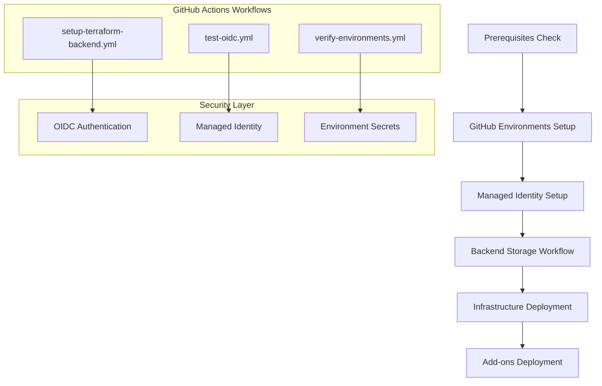
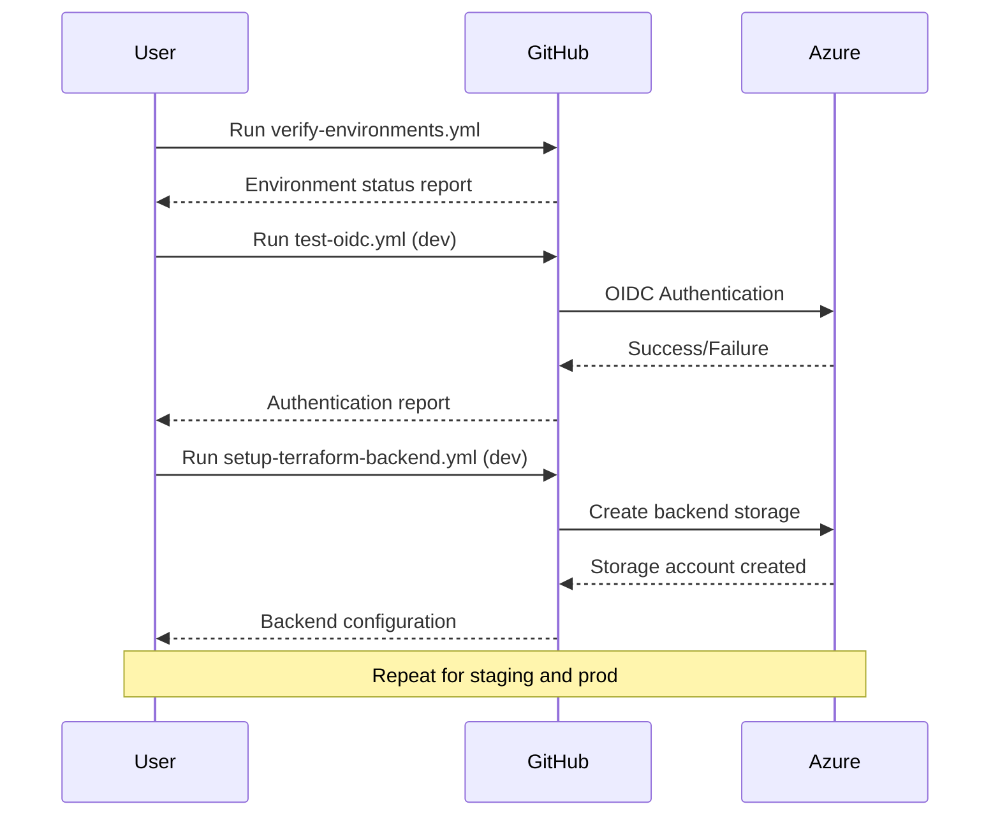
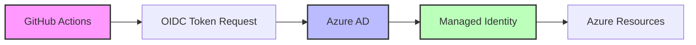

# GitHub Actions Workflows

Automated workflows for AKS Private Cluster infrastructure management with secure OIDC authentication.

## 🏗️ Architecture Overview



## 📋 Workflow Catalog

### 1. `verify-environments.yml`
**🔍 Verify GitHub Environments**

**Purpose**: Validates that GitHub environments are properly configured with required protection rules.

**Trigger**: 
- Manual (`workflow_dispatch`)
- No parameters required

**Usage**:
```yaml
# Navigate to Actions tab in GitHub
# Select "🔍 Verify GitHub Environments" workflow
# Click "Run workflow" button
```

**What it does**:
1. ✅ Verifies existence of `dev`, `staging`, `prod` environments
2. 📋 Checks environment protection rules and settings
3. 🔍 Validates environment configuration
4. 📄 Generates environment status report

**Output Artifacts**:
- `environment-status-report` - Detailed environment configuration

**Security Notes**:
- 🔒 **Safe to run** - Read-only environment checks
- 📋 **No Azure access** - Only checks GitHub configuration
- ✅ **No secrets required** - Uses GitHub token only

---

### 2. `setup-terraform-backend.yml`
**🏗️ Setup Terraform Backend Storage**

**Purpose**: Creates environment-specific Azure storage accounts for Terraform state management.

**Trigger**: 
- Manual (`workflow_dispatch`)
- **Required Parameter**: `environment` (dev, staging, prod)

**Usage**:
```yaml
# Navigate to Actions tab in GitHub
# Select "🏗️ Setup Terraform Backend Storage" workflow
# Click "Run workflow" button
# Select environment: dev, staging, or prod
```

**Prerequisites**:
- ✅ GitHub environments created (`verify-environments.yml`)
- ✅ Managed identity setup completed
- ✅ Environment secrets configured:
  - `AZURE_CLIENT_ID`
  - `AZURE_TENANT_ID`
  - `AZURE_SUBSCRIPTION_ID`

**What it does**:
1. 🔐 Authenticates with Azure using OIDC
2. 🏗️ Creates resource group for backend storage
3. 💾 Creates storage account with unique naming
4. 🔒 Configures storage account security settings
5. 📊 Tests backend access and permissions
6. 📋 Generates backend configuration report

**Output Artifacts**:
- `backend-config-{environment}` - Backend configuration files
- `backend-status-report-{environment}` - Detailed setup report

**Security Features**:
- 🔐 **OIDC Authentication** - No long-lived secrets
- 🔒 **Environment isolation** - Separate storage per environment
- 📋 **Audit logging** - All operations logged in Azure
- 🛡️ **Principle of least privilege** - Minimal required permissions

---

### 3. `test-oidc.yml`
**🧪 Test OIDC Authentication**

**Purpose**: Validates OIDC authentication and Azure permissions for each environment.

**Trigger**: 
- Manual (`workflow_dispatch`)
- **Required Parameter**: `environment` (dev, staging, prod)

**Usage**:
```yaml
# Navigate to Actions tab in GitHub
# Select "🧪 Test OIDC Authentication" workflow
# Click "Run workflow" button
# Select environment: dev, staging, or prod
```

**Prerequisites**:
- ✅ Managed identity setup completed
- ✅ Environment secrets configured
- ✅ OIDC federated credentials configured

**What it does**:
1. 🔐 Tests Azure CLI authentication via OIDC
2. 🔍 Verifies subscription access
3. 📋 Lists accessible resource groups
4. 💾 Tests storage account permissions
5. 📊 Validates required Azure permissions

**Security Notes**:
- 🧪 **Safe to run** - Read-only permission tests
- 🔍 **Validation only** - No resource modifications
- 📋 **Audit friendly** - All operations logged

---

## 🚀 Execution Guide

### Initial Setup Sequence

1. **Prerequisites Validation**
   ```bash
   # Run locally first
   ./scripts/check-prerequisites.sh
   ```

2. **GitHub Environments Setup**
   ```bash
   # Run locally (admin required)
   ./scripts/setup-github-environments.sh
   ```

3. **Verify Environments**
   ```yaml
   # GitHub Actions: Run verify-environments.yml
   # Check output artifacts for environment status
   ```

4. **Managed Identity Setup**
   ```bash
   # Run locally (admin required)
   ./scripts/setup-terraform-backend-identity.sh
   ```

5. **Test OIDC Authentication**
   ```yaml
   # GitHub Actions: Run test-oidc.yml for each environment
   # Parameters: environment = dev, staging, prod
   ```

6. **Create Backend Storage**
   ```yaml
   # GitHub Actions: Run setup-terraform-backend.yml for each environment
   # Parameters: environment = dev, staging, prod
   ```

### Workflow Execution Order



## 🔐 Security & Permissions

### Authentication Flow



### Required Secrets per Environment

Each environment needs these secrets configured:

| Secret | Purpose | Example |
|--------|---------|---------|
| `AZURE_CLIENT_ID` | Managed identity client ID | `12345678-1234-1234-1234-123456789012` |
| `AZURE_TENANT_ID` | Azure AD tenant ID | `87654321-4321-4321-4321-210987654321` |
| `AZURE_SUBSCRIPTION_ID` | Azure subscription ID | `abcdef12-3456-7890-abcd-ef1234567890` |

### Permission Matrix

| Workflow | Azure Permissions | GitHub Permissions |
|----------|-------------------|-------------------|
| `verify-environments.yml` | None | Repository read |
| `setup-terraform-backend.yml` | Contributor | Environment secrets |
| `test-oidc.yml` | Reader | Environment secrets |

## 📊 Artifacts & Reports

### Backend Configuration Artifacts

**File**: `backend-config-{environment}.txt`
```hcl
# Example content
terraform {
  backend "azurerm" {
    resource_group_name  = "rg-tfstate-dev-001"
    storage_account_name = "sttfstatedev001"
    container_name       = "tfstate"
    key                  = "terraform.tfstate"
  }
}
```

**File**: `backend-status-report-{environment}.md`
```markdown
# Terraform Backend Status Report - DEV

## Backend Configuration
- **Resource Group**: rg-tfstate-dev-001
- **Storage Account**: sttfstatedev001
- **Container**: tfstate
- **Location**: Central US

## Security Features
- ✅ HTTPS traffic only
- ✅ Secure transfer required
- ✅ Public access blocked
- ✅ Encryption at rest enabled
```

### Environment Status Report

**File**: `environment-status-report.md`
```markdown
# GitHub Environments Status Report

## Environment Configuration
- ✅ **DEV**: Configured with protection rules
- ✅ **STAGING**: Configured with protection rules  
- ✅ **PROD**: Configured with protection rules

## Security Configuration
- 🔒 Environment protection rules active
- 🔐 Required reviewers configured
- ⏱️ Deployment delays configured
```

## 🚨 Troubleshooting

### Common Issues

#### 1. **OIDC Authentication Failed**
```
Error: Failed to get access token for 'https://management.azure.com/'
```
**Solution**:
- Verify `AZURE_CLIENT_ID` secret is correct
- Check federated credential configuration
- Ensure managed identity has proper permissions

#### 2. **Environment Not Found**
```
Error: Environment 'dev' not found in repository
```
**Solution**:
- Run `verify-environments.yml` workflow first
- Check if `setup-github-environments.sh` completed successfully
- Verify repository admin permissions

#### 3. **Storage Account Name Conflict**
```
Error: Storage account name 'sttfstatedev001' is already taken
```
**Solution**:
- Storage account names must be globally unique
- The workflow uses timestamp suffix to avoid conflicts
- Check Azure portal for existing storage accounts

#### 4. **Permission Denied**
```
Error: The client does not have authorization to perform action
```
**Solution**:
- Verify managed identity has Contributor role
- Check Azure subscription permissions
- Review federated credential configuration

### Debug Steps

1. **Check Workflow Logs**
   ```yaml
   # In GitHub Actions tab
   # Click on failed workflow run
   # Expand step details for error messages
   ```

2. **Verify Secrets Configuration**
   ```yaml
   # Repository Settings > Environments > [Environment]
   # Check all required secrets are configured
   ```

3. **Test OIDC Authentication**
   ```yaml
   # Run test-oidc.yml workflow
   # Check authentication and permission results
   ```

4. **Validate Azure Configuration**
   ```bash
   # Run locally with Azure CLI
   az account show
   az ad sp show --id <CLIENT_ID>
   ```

## 📚 Additional Resources

### GitHub Actions Documentation
- [GitHub Environments](https://docs.github.com/en/actions/deployment/targeting-different-environments/using-environments-for-deployment)
- [GitHub OIDC](https://docs.github.com/en/actions/deployment/security-hardening-your-deployments/about-security-hardening-with-openid-connect)
- [Workflow Syntax](https://docs.github.com/en/actions/using-workflows/workflow-syntax-for-github-actions)

### Azure Documentation
- [Azure Managed Identity](https://docs.microsoft.com/en-us/azure/active-directory/managed-identities-azure-resources/)
- [Azure Storage Security](https://docs.microsoft.com/en-us/azure/storage/common/storage-security-guide)
- [Terraform AzureRM Backend](https://www.terraform.io/docs/language/settings/backends/azurerm.html)

### Security Best Practices
- [GitHub Security Hardening](https://docs.github.com/en/actions/security-guides/security-hardening-for-github-actions)
- [Azure Security Baseline](https://docs.microsoft.com/en-us/security/benchmark/azure/baselines/storage-security-baseline)

---

**🔒 Security First**: All workflows implement OIDC authentication and follow the principle of least privilege.
