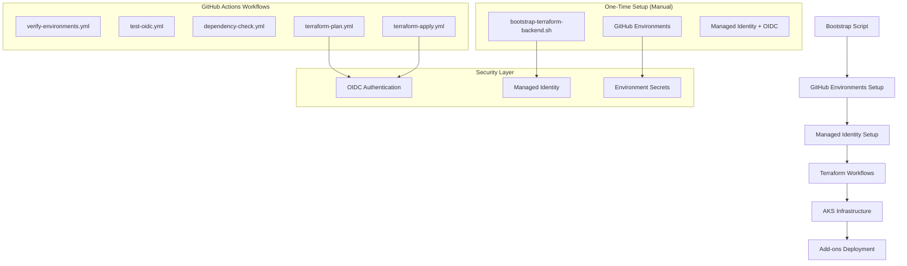
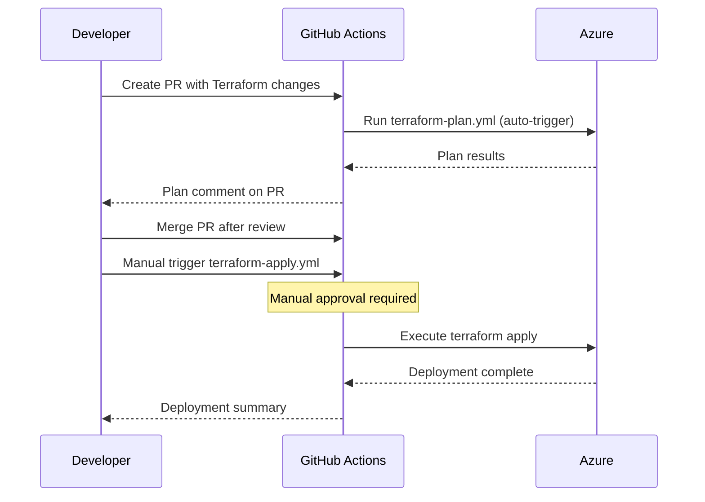
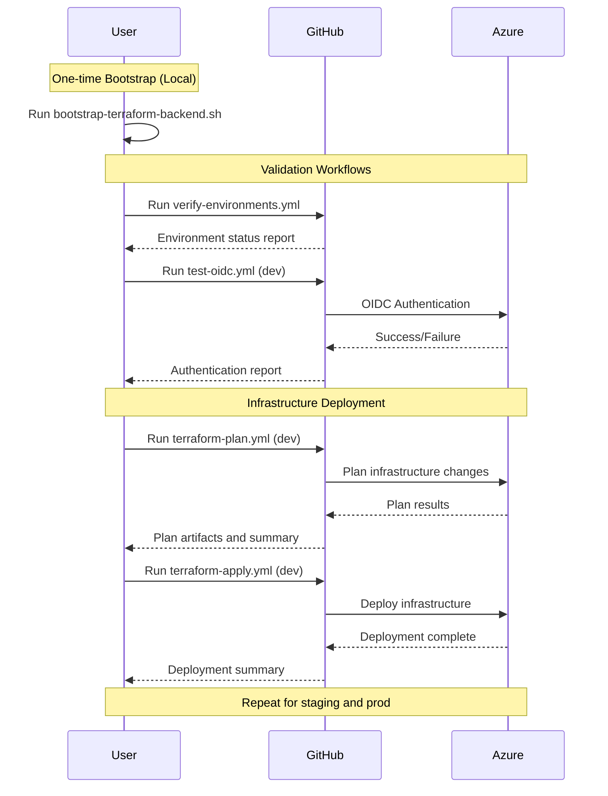
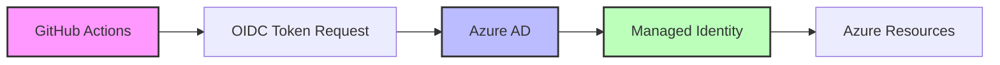

# GitHub Actions Workflows

Automated workflows for AKS Private Cluster infrastructure management with secure OIDC authentication.

## 🏗️ Architecture Overview



## 📋 Workflow Catalog

### 1. `verify-environments.yml`
**🔍 Verify GitHub Environments**

**Purpose**: Validates that GitHub environments are properly configured with required protection rules.

**Trigger**: 
- Manual (`workflow_dispatch`)
- No parameters required

**Usage**:
```yaml
# Navigate to Actions tab in GitHub
# Select "🔍 Verify GitHub Environments" workflow
# Click "Run workflow" button
```

**What it does**:
1. ✅ Verifies existence of `dev`, `staging`, `prod` environments
2. 📋 Checks environment protection rules and settings
3. 🔍 Validates environment configuration
4. 📄 Generates environment status report

**Output Artifacts**:
- `environment-status-report` - Detailed environment configuration

**Security Notes**:
- 🔒 **Safe to run** - Read-only environment checks
- 📋 **No Azure access** - Only checks GitHub configuration
- ✅ **No secrets required** - Uses GitHub token only

---

### 2. `test-oidc.yml`
**🧪 Test OIDC Authentication**

**Purpose**: Validates OIDC authentication and Azure permissions for each environment.

**Trigger**: 
- Manual (`workflow_dispatch`)
- **Required Parameter**: `environment` (dev, staging, prod)

**Usage**:
```yaml
# Navigate to Actions tab in GitHub
# Select "🧪 Test OIDC Authentication" workflow
# Click "Run workflow" button
# Select environment: dev, staging, or prod
```

**Prerequisites**:
- ✅ Bootstrap script completed (`bootstrap-terraform-backend.sh`)
- ✅ Environment secrets configured:
  - `AZURE_CLIENT_ID`
  - `AZURE_TENANT_ID` 
  - `AZURE_SUBSCRIPTION_ID`

**What it does**:
1. 🔐 Tests Azure CLI authentication via OIDC
2. 🔍 Verifies subscription access
3. 📋 Lists accessible resource groups
4. 💾 Tests storage account permissions
5. 📊 Validates required Azure permissions

**Security Notes**:
- 🧪 **Safe to run** - Read-only permission tests
- 🔍 **Validation only** - No resource modifications
- 📋 **Audit friendly** - All operations logged

---

### 3. `dependency-check.yml`
**🔍 Dependency Warning Check**

**Purpose**: Monitors for Python, Azure CLI, and other dependency warnings that could affect workflows.

**Trigger**: 
- Manual (`workflow_dispatch`)
- Scheduled (weekly on Mondays at 9 AM UTC)

**Usage**:
```yaml
# Runs automatically on schedule
# Can also be triggered manually from Actions tab
```

**What it does**:
1. 🔍 Scans for Python dependency warnings (pkg_resources, setuptools)
2. 🛡️ Checks Azure CLI for deprecation warnings
3. 📊 Generates comprehensive dependency report
4. 🚨 Creates GitHub issues for critical warnings
5. 📤 Uploads detailed warning logs as artifacts

**Output Artifacts**:
- `dependency-warnings-report` - Detailed warning analysis
- `dependency-warnings-raw` - Raw warning logs

**Security Notes**:
- 🔒 **Safe to run** - No Azure access required
- 📋 **Monitoring only** - No system modifications
- 🔔 **Proactive** - Helps prevent workflow failures

---

### 4. `terraform-plan.yml`
**� Terraform Plan & Validation**

**Purpose**: Validates Terraform configuration and generates deployment plans for review.

**Trigger**: 
- Manual (`workflow_dispatch`)
- Pull requests affecting `infra/tf/**`
- Push to main branch (auto-plan)

**Parameters**:
- `environment` (dev, staging, prod)
- `destroy_plan` (boolean) - Generate destroy plan instead of apply plan
- `detailed_output` (boolean) - Show detailed plan output in logs

**Usage**:
```yaml
# Manual execution
# Navigate to Actions tab
# Select "🔍 Terraform Plan & Validation" workflow
# Choose environment and options
```

**Prerequisites**:
- ✅ Bootstrap script completed
- ✅ Backend configuration in place
- ✅ Environment secrets configured

**What it does**:
1. 🔐 Authenticates with Azure using OIDC
2. � Validates Terraform configuration syntax
3. 🏗️ Initializes Terraform with remote backend
4. 🛡️ Runs security scanning with Checkov
5. 📋 Generates detailed plan for changes
6. 💬 Comments plan summary on PRs (if applicable)
7. 📤 Uploads plan files and reports as artifacts

**Output Artifacts**:
- `terraform-plan-{env}-{run}` - Plan files and outputs
- `plan-summary.md` - Human-readable plan summary
- `checkov-report.sarif` - Security scan results

**Security Features**:
- 🔐 **OIDC Authentication** - No long-lived secrets
- 🛡️ **Security Scanning** - Automated vulnerability detection
- 📋 **Change Review** - Detailed plan analysis before apply
- 🔒 **Environment isolation** - Separate plans per environment

---

### 5. `terraform-apply.yml`
**� Terraform Apply & Deploy**

**Purpose**: Executes Terraform deployments to create and manage AKS infrastructure.

**Trigger**: 
- Manual (`workflow_dispatch`)
- Requires plan artifact from terraform-plan workflow

**Parameters**:
- `environment` (dev, staging, prod)
- `plan_run_number` - Run number from terraform-plan workflow
- `auto_approve` (boolean) - Skip manual approval (use carefully)

**Usage**:
```yaml
# Must run terraform-plan first
# Navigate to Actions tab
# Select "� Terraform Apply & Deploy" workflow
# Specify environment and plan run number
```

**Prerequisites**:
- ✅ Bootstrap script completed
- ✅ terraform-plan workflow completed successfully
- ✅ Plan artifacts available
- ✅ Manual approval (unless auto_approve enabled)

**What it does**:
1. 🔐 Authenticates with Azure using OIDC
2. 📥 Downloads plan artifacts from specified run
3. 🔍 Validates plan integrity and environment
4. ⏱️ Waits for manual approval (if required)
5. 🚀 Executes terraform apply with generated plan
6. 📊 Generates deployment summary and metrics
7. 📤 Uploads deployment logs and state info

**Output Artifacts**:
- `terraform-apply-{env}-{run}` - Apply logs and results
- `deployment-summary.md` - Deployment report
- `post-deployment-info.json` - Resource details for add-ons

**Security Features**:
- 🔐 **OIDC Authentication** - No long-lived secrets
- ✅ **Plan Validation** - Only applies pre-validated plans
- 🛡️ **Manual Approval** - Human verification before deployment
- 📋 **Audit Trail** - Complete deployment logging

---

## 🚀 Execution Guide

### Initial Setup Sequence

**⚠️ Note**: Backend setup is now done via bootstrap script, not workflows.

1. **Prerequisites Validation**
   ```bash
   # Run locally first
   ./scripts/check-prerequisites.sh
   ```

2. **Bootstrap Backend Storage**
   ```bash
   # Run locally (admin required)
   ./scripts/bootstrap-terraform-backend.sh
   ```

3. **Verify Environments**
   ```yaml
   # GitHub Actions: Run verify-environments.yml
   # Check output artifacts for environment status
   ```

4. **Test OIDC Authentication**
   ```yaml
   # GitHub Actions: Run test-oidc.yml for each environment
   # Parameters: environment = dev, staging, prod
   ```

5. **Plan Infrastructure**
   ```yaml
   # GitHub Actions: Run terraform-plan.yml for each environment
   # Review generated plans and security scan results
   ```

6. **Deploy Infrastructure**
   ```yaml
   # GitHub Actions: Run terraform-apply.yml for each environment
   # Use plan artifacts from previous step
   ```

### Typical Development Workflow


### Workflow Execution Order



## 🔐 Security & Permissions

### Authentication Flow



### Required Secrets per Environment

Each environment needs these secrets configured:

| Secret | Purpose | Example |
|--------|---------|---------|
| `AZURE_CLIENT_ID` | Managed identity client ID | `12345678-1234-1234-1234-123456789012` |
| `AZURE_TENANT_ID` | Azure AD tenant ID | `87654321-4321-4321-4321-210987654321` |
| `AZURE_SUBSCRIPTION_ID` | Azure subscription ID | `abcdef12-3456-7890-abcd-ef1234567890` |

### Permission Matrix

| Workflow | Azure Permissions | GitHub Permissions |
|----------|-------------------|-------------------|
| `verify-environments.yml` | None | Repository read |
| `test-oidc.yml` | Reader | Environment secrets |
| `dependency-check.yml` | None | Repository read, Issues write |
| `terraform-plan.yml` | Contributor (scope: resource group) | Environment secrets, PR comments |
| `terraform-apply.yml` | Contributor (scope: resource group) | Environment secrets |

## � Artifacts & Reports

### Terraform Plan Artifacts

**File**: `terraform-plan-{environment}-{run-number}`
- `tfplan` - Binary plan file
- `plan-output.txt` - Human-readable plan
- `plan-summary.md` - Formatted summary
- `checkov-report.sarif` - Security scan results

**Example plan-summary.md**:
```markdown
# Terraform Plan Summary - DEV

## Plan Overview
**Environment**: dev
**Plan Type**: Apply
**Generated**: 2025-07-08 14:30:00 UTC

## Resource Changes
| Action | Count |
|--------|-------|
| 🟢 Add | 15 |
| 🟡 Change | 2 |
| 🔴 Destroy | 0 |

## Validation Results
- ✅ **Terraform Validation**: Passed
- ✅ **Security Scan**: No critical issues
- ✅ **Plan Generation**: Success
```

### Terraform Apply Artifacts

**File**: `terraform-apply-{environment}-{run-number}`
- `apply-output.txt` - Apply execution log
- `deployment-summary.md` - Deployment report
- `post-deployment-info.json` - Resource details

### Environment Status Report

**File**: `environment-status-report.md`
```markdown
# GitHub Environments Status Report

## Environment Configuration
- ✅ **DEV**: Configured with protection rules
- ✅ **STAGING**: Configured with protection rules  
- ✅ **PROD**: Configured with protection rules

## Security Configuration
- 🔒 Environment protection rules active
- 🔐 Required reviewers configured
- ⏱️ Deployment delays configured
```
    GitHub-->>User: Authentication report
    
    User->>GitHub: Run setup-terraform-backend.yml (dev)
    GitHub->>Azure: Create backend storage
    Azure-->>GitHub: Storage account created
    GitHub-->>User: Backend configuration
    
    Note over User,Azure: Repeat for staging and prod
```

## 🔐 Security & Permissions

### Authentication Flow


### Required Secrets per Environment

Each environment needs these secrets configured:

| Secret | Purpose | Example |
|--------|---------|---------|
| `AZURE_CLIENT_ID` | Managed identity client ID | `12345678-1234-1234-1234-123456789012` |
| `AZURE_TENANT_ID` | Azure AD tenant ID | `87654321-4321-4321-4321-210987654321` |
| `AZURE_SUBSCRIPTION_ID` | Azure subscription ID | `abcdef12-3456-7890-abcd-ef1234567890` |

### Permission Matrix

| Workflow | Azure Permissions | GitHub Permissions |
|----------|-------------------|-------------------|
| `verify-environments.yml` | None | Repository read |
| `setup-terraform-backend.yml` | Contributor | Environment secrets |
| `test-oidc.yml` | Reader | Environment secrets |

## 📊 Artifacts & Reports

### Backend Configuration Artifacts

**File**: `backend-config-{environment}.txt`
```hcl
# Example content
terraform {
  backend "azurerm" {
    resource_group_name  = "rg-tfstate-dev-001"
    storage_account_name = "sttfstatedev001"
    container_name       = "tfstate"
    key                  = "terraform.tfstate"
  }
}
```

**File**: `backend-status-report-{environment}.md`
```markdown
# Terraform Backend Status Report - DEV

## Backend Configuration
- **Resource Group**: rg-tfstate-dev-001
- **Storage Account**: sttfstatedev001
- **Container**: tfstate
- **Location**: Central US

## Security Features
- ✅ HTTPS traffic only
- ✅ Secure transfer required
- ✅ Public access blocked
- ✅ Encryption at rest enabled
```

### Environment Status Report

**File**: `environment-status-report.md`
```markdown
# GitHub Environments Status Report

## Environment Configuration
- ✅ **DEV**: Configured with protection rules
- ✅ **STAGING**: Configured with protection rules  
- ✅ **PROD**: Configured with protection rules

## Security Configuration
- 🔒 Environment protection rules active
- 🔐 Required reviewers configured
- ⏱️ Deployment delays configured
```

## 🚨 Troubleshooting

### Common Issues

#### 1. **OIDC Authentication Failed**
```
Error: Failed to get access token for 'https://management.azure.com/'
```
**Solution**:
- Verify `AZURE_CLIENT_ID` secret is correct
- Check federated credential configuration
- Ensure managed identity has proper permissions

#### 2. **Environment Not Found**
```
Error: Environment 'dev' not found in repository
```
**Solution**:
- Run `verify-environments.yml` workflow first
- Check if `setup-github-environments.sh` completed successfully
- Verify repository admin permissions

#### 3. **Storage Account Name Conflict**
```
Error: Storage account name 'sttfstatedev001' is already taken
```
**Solution**:
- Storage account names must be globally unique
- The workflow uses timestamp suffix to avoid conflicts
- Check Azure portal for existing storage accounts

#### 4. **Permission Denied**
```
Error: The client does not have authorization to perform action
```
**Solution**:
- Verify managed identity has Contributor role
- Check Azure subscription permissions
- Review federated credential configuration

### Debug Steps

1. **Check Workflow Logs**
   ```yaml
   # In GitHub Actions tab
   # Click on failed workflow run
   # Expand step details for error messages
   ```

2. **Verify Secrets Configuration**
   ```yaml
   # Repository Settings > Environments > [Environment]
   # Check all required secrets are configured
   ```

3. **Test OIDC Authentication**
   ```yaml
   # Run test-oidc.yml workflow
   # Check authentication and permission results
   ```

4. **Validate Azure Configuration**
   ```bash
   # Run locally with Azure CLI
   az account show
   az ad sp show --id <CLIENT_ID>
   ```

## 📚 Additional Resources

### GitHub Actions Documentation
- [GitHub Environments](https://docs.github.com/en/actions/deployment/targeting-different-environments/using-environments-for-deployment)
- [GitHub OIDC](https://docs.github.com/en/actions/deployment/security-hardening-your-deployments/about-security-hardening-with-openid-connect)
- [Workflow Syntax](https://docs.github.com/en/actions/using-workflows/workflow-syntax-for-github-actions)

### Azure Documentation
- [Azure Managed Identity](https://docs.microsoft.com/en-us/azure/active-directory/managed-identities-azure-resources/)
- [Azure Storage Security](https://docs.microsoft.com/en-us/azure/storage/common/storage-security-guide)
- [Terraform AzureRM Backend](https://www.terraform.io/docs/language/settings/backends/azurerm.html)

### Security Best Practices
- [GitHub Security Hardening](https://docs.github.com/en/actions/security-guides/security-hardening-for-github-actions)
- [Azure Security Baseline](https://docs.microsoft.com/en-us/security/benchmark/azure/baselines/storage-security-baseline)

---

**🔒 Security First**: All workflows implement OIDC authentication and follow the principle of least privilege.
